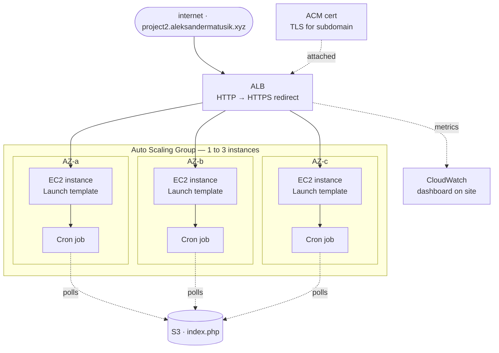
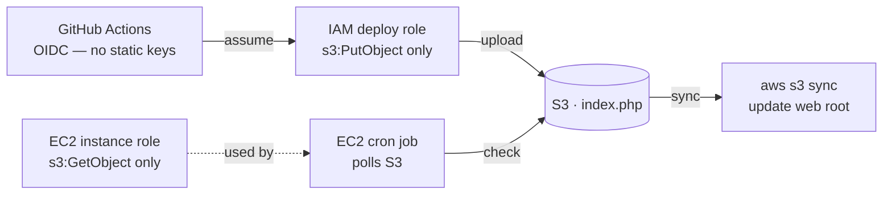

# AWS High-Availability Web Stack

A production-pattern web stack on AWS demonstrating multi-AZ high availability, least-privilege IAM design, and keyless CI/CD via GitHub OIDC.

Live at: `https://project2.aleksandermatusik.xyz`

## Architecture

### Traffic flow

### CI/CD and deployment flow

## How it works

Site under my domain, big button that simulates real world traffic (by using stress command on an ec2 instance). ASG automatically boots up other instances and ALB distributes traffic across multiple AZ's.
Content is deployed by pushing `index.php` to an S3 bucket via GitHub Actions. Each EC2 instance runs a cron job that periodically checks the bucket for changes and syncs the file to the web root using `aws s3 sync`. No deployment agent, no push credentials on the instances.
After some time panel from cloudwatch shows number of instance running and cpu utillization (almost 100% for 10 min.)

---

## Architecture decisions

**t3.nano used** For maximum cost savings I used the cheapest option available on aws. It gets the job done and for the whole month of running it costs only 4$. I thought about spot instances but do not want random interruptions as well as reserved savings plan, if I ever need to clear this project.

**No CloudFront.** CloudFront would cache content at the edge and hide the multi-AZ load balancing behavior this project is designed to demonstrate. Watching the server IP rotate across availability zones on refresh is the point.

**Cron job over event-driven deployment.** S3 event notifications to SNS to Lambda would be more reactive but adds infrastructure complexity and cost for a project that deploys infrequently. A cron poll costs fractions of a cent (S3 `ListObjects` at $0.005/1000 requests, `GetObject` only fires on change) and keeps the deployment path simple and stateless.

**OIDC instead of static IAM keys.** GitHub Actions assumes an IAM role via OpenID Connect. No long-lived credentials are stored in GitHub secrets, and the role can only be assumed by this specific repository and workflow.

**Traffic locked to ALB.** EC2 security groups accept inbound traffic only from the ALB security group — not from the public internet directly. This means the ALB is the sole entry point and its HTTP→HTTPS redirect cannot be bypassed.

**No WAF** As there is already function that limits ASG usage I decided not to incorporate WAF into my project.

---

## Services used

| Service | Role |
|---|---|
| EC2 + Launch Template | Web servers, cron-based deployment |
| Auto Scaling Group | Scales instances 1–3 based on demand |
| Application Load Balancer | Multi-AZ traffic distribution, HTTP→HTTPS redirect |
| ACM | TLS certificate for custom subdomain |
| S3 | Deployment artifact store |
| IAM | Least-privilege roles for EC2, ASG, and CI/CD |
| CloudWatch | Metrics dashboard embedded on the site |
| GitHub Actions (OIDC) | Keyless CI/CD pipeline |

---

## CI/CD pipeline

On every push to `main`:

1. GitHub Actions requests a short-lived token from AWS via OIDC
2. The token is exchanged for temporary credentials by assuming the deploy IAM role
3. `index.php` is uploaded to the S3 deployment bucket
4. Each EC2 instance's cron job detects the change on its next run and syncs the file to the web root

No secrets are stored in GitHub. The IAM role trust policy restricts assumption to this repository and branch.

---
## Problems I encountered
- Thought about cheapest options possible - built whole site on t2.nano (as it was on the top of the list), then changed it to t3.nano for 0.0007$ per hour savings
- EC2 Instance wasn't taking any files from s3, quick look and I forgot about adding IAM permissions into the EC2 startup configuration.
- When I finished this project I thought about hosting it under my main domain and with that have ssl certificate, i had to change inbound SG rules and redirect all http trafiic onto the https.
- My first project is my main site, for convenience i was operating in us-east-1 so the acm certificate was only there. I requested new certificate *.aleksandermatusik.xyz for easier future deployment, added it to namecheap dns records and voila.

---
## What I'd add next

- **RDS Multi-AZ** if the project needed a database layer
- **ElastiCache** for session or query caching
- **S3 event notifications** to replace the cron job if deployment frequency increased significantly
- **Terraform and CodeDeploy**