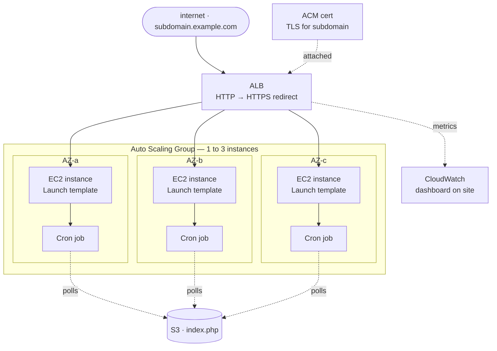
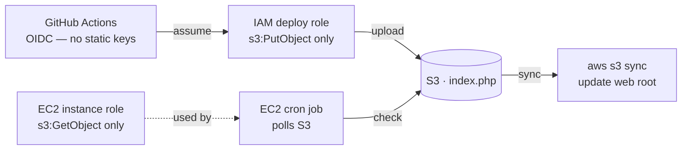

# alb-asg-project

```mermaid
graph TD
    Internet([internet · subdomain.example.com]) --> ALB
    ACM[ACM cert\nTLS for subdomain] -.->|attached| ALB

    ALB[ALB\nHTTP → HTTPS redirect]

    ALB --> EC2a
    ALB --> EC2b
    ALB --> EC2c

    subgraph ASG["Auto Scaling Group — 1 to 3 instances"]
      subgraph AZa[AZ-a]
        EC2a[EC2 instance\nLaunch template] --> Cron1[Cron job]
      end
      subgraph AZb[AZ-b]
        EC2b[EC2 instance\nLaunch template] --> Cron2[Cron job]
      end
      subgraph AZc[AZ-c]
        EC2c[EC2 instance\nLaunch template] --> Cron3[Cron job]
      end
    end

    Cron1 -.->|polls| S3[(S3 · index.php)]
    Cron2 -.->|polls| S3
    Cron3 -.->|polls| S3

    ALB -.->|metrics| CW[CloudWatch\ndashboard on site]
```

```mermaid
graph LR
    GHA[GitHub Actions\nOIDC — no static keys] -->|assume| DeployRole[IAM deploy role\ns3:PutObject only]
    DeployRole -->|upload| S3[(S3 · index.php)]

    EC2Role[EC2 instance role\ns3:GetObject only] -.->|used by| Cron
    Cron[EC2 cron job\npolls S3] -->|check| S3
    S3 -->|sync| WebRoot[aws s3 sync\nupdate web root]
```